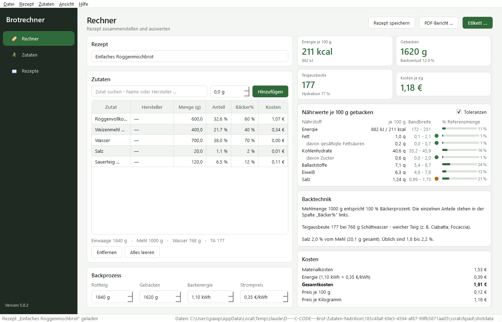
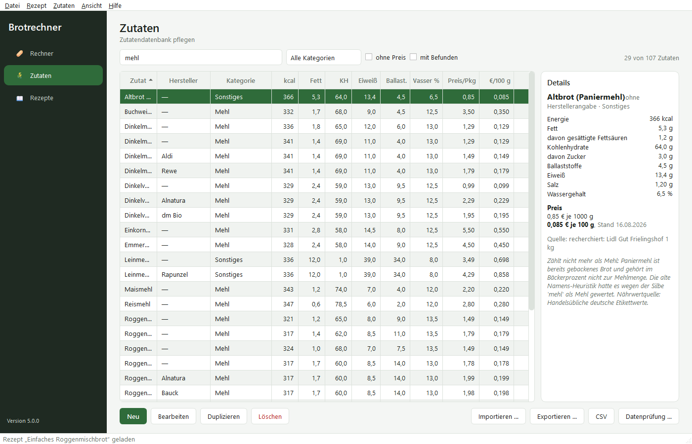
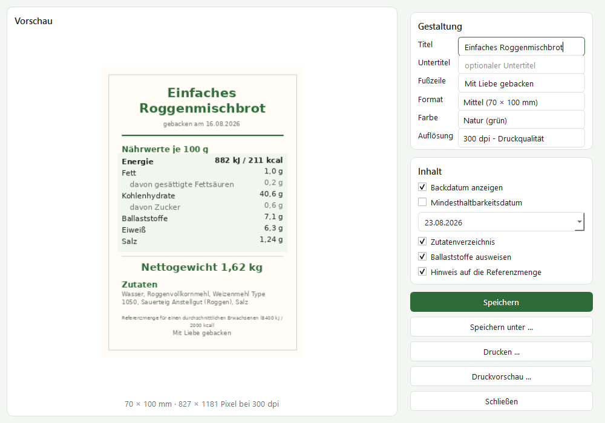

# Nutrition-Brotrechner

Nährwerte, Kosten, Bäckerprozent und Teigausbeute für selbstgebackenes Brot –
mit druckfertigem Etikett nach EU-Kennzeichnungsrecht.

Läuft unter **Linux, Windows und macOS**.

> **Vollständig KI-generiert.** Der gesamte Quelltext dieses Projekts wurde von
> Claude (Anthropic) erzeugt. Kein Teil ist von Hand geschrieben. Die fachlichen
> Vorgaben, die Entscheidungen über Aufbau und Funktionsumfang sowie die Abnahme
> stammen von **Martin Kraus**.



## Was das Programm kann

**Rechnen.** Zutaten zusammenstellen, Gewicht des fertigen Brots eintragen –
Nährwerte je 100 g, Bäckerprozent, Teigausbeute, Hydration und Kosten stehen
sofort daneben. Ohne Knopfdruck: Jede Änderung wird unmittelbar übernommen.
Mit dem Gewicht einer Portion – Scheibe, Stück, Brötchen – kommen Nährwerte
und Preis je Portion hinzu und wie viele Portionen das Brot ergibt.

**Etikettieren.** Ein Nährwert-Etikett in vier Formaten oder einem eigenen
(30 bis 297 mm je Seite) und drei Farbstimmungen, mit Vorschau. Speichern,
„Speichern unter“ oder direkt in den Druckdialog – ohne Umweg über eine Datei
und immer in Originalgröße: einzeln mitten aufs Blatt, am Etikettendrucker
(auf Wunsch um 90° gedreht), auf Etikettenbögen nach den Maßen der Verpackung
– auch ab dem ersten freien Etikett eines angebrochenen Bogens – oder zu
mehreren auf A4 zum Ausschneiden. Aufbau und Reihenfolge folgen Anhang XV der
VO (EU) Nr. 1169/2011. Backdatum und Mindesthaltbarkeit sind frei wählbar: Das
Backdatum zieht die Haltbarkeit mit sich, eine von Hand gesetzte Haltbarkeit
bleibt erhalten. Das Zutatenverzeichnis folgt Artikel 18: absteigend nach
Gewicht, zugefügtes Wasser nach seinem Anteil im fertigen Brot, gleichnamige
Zutaten zusammengefasst, Allergene fett. Ohne Verzeichnis steht „Enthält: …“
mit den Allergenen auf dem Etikett. Hat das Rezept eine Portion, zeigt die
Nährwerttabelle zusätzlich die Werte je Portion samt der Zahl der Portionen
(Artikel 33).

**Verkaufen.** Mit „Etikett für den Verkauf“ prüft der Etikettdialog laufend
die Pflichtangaben für verpackt verkauftes Brot (Artikel 9 VO (EU)
Nr. 1169/2011): Bezeichnung, Zutatenverzeichnis mit erfassten Allergenen,
Nettogewicht, Mindesthaltbarkeitsdatum sowie Name und Anschrift des
Herstellers; ein Aufbewahrungshinweis ist möglich. Jede Schrift hat dann
mindestens 1,2 mm x-Höhe (Artikel 13, Anhang IV), die Ziffern des Gewichts
die Mindesthöhe der Fertigpackungsverordnung (bis 1 kg 4 mm, darüber 6 mm),
und das Zutatenverzeichnis wird nicht gekürzt. Geprüft wird das gezeichnete
Etikett in Druckauflösung, nicht nur die Eingaben. Offene Punkte stehen im
Dialog; Speichern und Drucken fragen dann nach. Die Prüfung ersetzt keine
Rechtsberatung.

**Prüfen.** Eine eingebaute Plausibilitätsprüfung findet Datenfehler, bevor sie
in einer Auswertung landen: verletzte Massenbilanz, ein Brennwert, der nicht zu
den Nährstoffen passt, unmögliche Wassergehalte, Dubletten. Auch von der
Kommandozeile aus, etwa in einer CI-Pipeline. Ebenso fallen Gewichte auf, die
nicht stimmen können – ein Brot, das schwerer ist als sein Teig oder leichter
als die Trockenmasse der Zutaten. Mit einem solchen Tippfehler entsteht kein
Etikett.

**Verwalten.** Zutaten mit eigenem Herstellerfeld, Preisen samt Quelle und
Preisstand, Preishistorie, Import und Export einzelner Zutaten als JSON,
Rezeptverwaltung mit Skalierung, PDF-Bericht, CSV-Export der Zutaten und der
Rezeptauswertung. Zu jeder Zutat gehören ihre **Allergene nach Anhang II** und
die **Bezeichnung im Zutatenverzeichnis**, in der das Allergen markiert ist
(`*Weizen*mehl Type 550`). Die Startdatenbank
bringt beides für alle 107 Zutaten mit; wo es vom gekauften Produkt abhängt –
Margarine, Essig, Trockenfrüchte, Oliven –, bleibt es bewusst „nicht erfasst“,
bis jemand die Packung angesehen hat.

**Nachhalten.** Notizen lassen sich jederzeit zu einem Rezept schreiben – was
schiefging, welcher Kniff half. Jedes erstellte Etikett vermerkt seinen Backtag
samt Haltbarkeit am Rezept, sodass beim nächsten Aufruf sichtbar ist, wann
zuletzt gebacken wurde.

| Zutatenverwaltung | Etikett mit Vorschau |
|---|---|
|  |  |

## Starten

**Ohne Installation, per Doppelklick.** Im Hauptordner liegt die Datei
**`Brotrechner starten.pyw`** – Doppelklick genügt. Die Endung `.pyw` ist unter
Windows mit dem Python-Starter verknüpft, das Programm öffnet also ohne
schwarzes Konsolenfenster. Voraussetzung ist lediglich ein Python ab 3.10 mit
PySide6 und Pillow:

```bash
pip install PySide6 Pillow reportlab
```

Fehlt etwas davon, erscheint beim Start ein Hinweisfenster mit dem passenden
Befehl – statt eines Fensters, das sich wortlos wieder schließt.

Für eine Verknüpfung auf dem Schreibtisch (Windows, PowerShell):

```powershell
$root = "PFAD\ZU\Nutrition-Brotrechner"
$ws = New-Object -ComObject WScript.Shell
$sc = $ws.CreateShortcut("$([Environment]::GetFolderPath('Desktop'))\Brotrechner.lnk")
$sc.TargetPath = (Get-Command pythonw).Source
$sc.Arguments  = '"' + (Join-Path $root "Brotrechner starten.pyw") + '"'
$sc.WorkingDirectory = $root
$sc.IconLocation = (Join-Path $root "src\brotrechner\gui\icons\brotrechner.ico") + ",0"
$sc.Save()
```

Unter Linux startet `python3 "Brotrechner starten.pyw"` oder – nach einer
Installation – schlicht `brotrechner`.

## Installation als Paket

```bash
git clone https://github.com/Paxipu/Nutrition-Brotrechner.git
cd Nutrition-Brotrechner
python -m venv .venv
source .venv/bin/activate        # Windows:  .venv\Scripts\activate
pip install -e ".[pdf]"
```

Danach steht der Befehl systemweit bereit:

```bash
brotrechner                      # Oberfläche
python -m brotrechner            # dasselbe, ohne installiertes Skript
```

Unter Linux braucht Qt zusätzlich die üblichen X11- bzw. Wayland-Bibliotheken.
Auf Debian/Ubuntu genügt in aller Regel:

```bash
sudo apt install libxcb-cursor0 libxkbcommon-x11-0
```

Der PDF-Bericht ist optional. Ohne `reportlab` fehlt nur diese eine Schaltfläche,
alles andere funktioniert unverändert.

## Kommandozeile

```bash
brotrechner check                # Datenprüfung, Exit-Code 1 bei Fehlern
brotrechner check --strict       # auch Warnungen führen zu Exit-Code 1
brotrechner export-csv out.csv   # Zutatendatenbank als CSV
brotrechner info                 # Pfade und Bestand
brotrechner --data-dir ./daten   # abweichendes Datenverzeichnis
```

## Wo die Daten liegen

Nutzerdaten liegen im dafür vorgesehenen Verzeichnis des Betriebssystems, damit
ein Programmupdate sie nie überschreibt:

| System    | Verzeichnis                                                 |
|-----------|-------------------------------------------------------------|
| Linux/BSD | `$XDG_DATA_HOME/brotrechner` bzw. `~/.local/share/brotrechner` |
| Windows   | `%APPDATA%\Brotrechner`                                      |
| macOS     | `~/Library/Application Support/Brotrechner`                  |

Zwei Auswege: Die Umgebungsvariable `BROTRECHNER_DATA_DIR` setzt das
Verzeichnis unabhängig vom System, und ein Ordner `data` neben dem
Projektverzeichnis schaltet den *portablen Modus* ein – praktisch für den
Betrieb vom USB-Stick.

Vor jedem Überschreiben legt das Programm eine Sicherung in `<Daten>/backups`
an und hält die zehn jüngsten Stände – aber nur, wenn sich der Inhalt wirklich
ändert; „Datei → Sicherung anlegen“ sichert den jetzigen Stand. Geschrieben
wird atomar: Ein Absturz mitten im Speichern kann keine halbe JSON-Datei
hinterlassen. Ist eine Datei beim Start unlesbar, wird sie unverändert als
`<Name>.defekt-<Zeitpunkt>.json` beiseitegelegt statt überschrieben.

Warnungen und Fehler stehen in `<Daten>/brotrechner.log`, der Pfad auch unter
„Hilfe → Über“. Ein unerwarteter Fehler erscheint zusätzlich als Meldung –
beim Start per Doppelklick gibt es sonst keine Konsole, auf der er stünde.

### Übernahme aus der Vorgängerversion

Liegen im Startverzeichnis die Dateien `brot_zutaten.json` und
`brot_rezepte.json` des alten Einzelskripts, werden sie beim ersten Start
automatisch übernommen und migriert. Die Originaldateien bleiben unverändert
liegen. Was dabei passiert, steht in
[`docs/DATENKORREKTUREN.md`](docs/DATENKORREKTUREN.md).

## Fachliche Grundlagen

| Größe | Definition |
|---|---|
| **Bäckerprozent** | Jede Zutat relativ zur Gesamtmehlmenge, die per Definition 100 % ist. Zur Mehlmenge trägt jede Zutat mit ihrem **Mehlanteil** bei: Mehl mit 100 %, ein Anstellgut aus gleichen Teilen Mehl und Wasser (TA 200) mit 50 %. Der Anteil ist je Zutat ein ausdrückliches Feld – keine Namensheuristik. |
| **Teigausbeute (TA)** | `(Mehl + Schüttwasser) / Mehl × 100`. Als Schüttwasser zählt das *tatsächlich enthaltene* Wasser außerhalb des Mehlanteils: 100 g Milch steuern 87,5 g bei, nicht 100 g; 200 g Anstellgut (TA 200) zählen als 100 g Mehl und 100 g Wasser. Die Eigenfeuchte des Mehls (13 %) gehört zum Mehl. |
| **Hydration** | `Schüttwasser / Mehl × 100`, also stets `TA − 100`. |
| **Brennwert** | Berechnet nach Anhang XIV VO (EU) Nr. 1169/2011: Kohlenhydrate 4, Eiweiß 4, Fett 9, **Ballaststoffe 2 kcal/g**. Der Ballaststoffanteil fehlt auf vielen Etiketten. |
| **Kohlenhydrate** | Nach EU-Konvention **ohne** Ballaststoffe. Wer Werte aus US-Quellen übernimmt, muss die Ballaststoffe vorher abziehen. |
| **Rundung** | Etikett und PDF-Bericht runden nach der Leitlinie der EU-Kommission von Dezember 2012: Brennwert auf ganze kJ/kcal; Fett, Kohlenhydrate, Zucker, Eiweiß und Ballaststoffe ab 10 g auf ganze Gramm, darunter auf 0,1 g und bis 0,5 g als „< 0,5 g“; Salz ab 1 g auf 0,1 g, darunter auf 0,01 g. Halbe werden aufgerundet. Der Rechner zeigt die genauen Werte, die Etikettangabe steht im Tooltip. |
| **Toleranzen** | Tabelle 1 der EU-Guidance zu Deklarationstoleranzen, Dezember 2012, angewandt auf die Werte des **fertigen Brots** – so, wie eine Kontrolle sie prüft. Für den Brennwert ist dort *keine* Toleranz definiert; er wird deshalb aus den Nährstoffgrenzen abgeleitet. |
| **Referenzmengen** | Anhang XIII Teil B VO (EU) Nr. 1169/2011 (8400 kJ / 2000 kcal). Ballaststoffe haben dort keine Referenzmenge – verglichen wird mit dem DGE-Richtwert von 30 g/Tag. |
| **Ampel** | Keine EU-Vorgabe, sondern die Kriterien der britischen Front-of-Pack-Kennzeichnung. Im Programm entsprechend gekennzeichnet. |

## Aufbau

```
src/brotrechner/
├── core/        Fachlogik, ohne GUI und ohne Dateizugriff
│   ├── nutrients.py    Nährwertvektor, Brennwertberechnung
│   ├── models.py       Zutat, Rezept, Kategorien
│   ├── analysis.py     Bäckerprozent, Teigausbeute, Kosten
│   ├── tolerances.py   EU-Deklarationstoleranzen
│   ├── reference.py    Referenzmengen und Ampel
│   └── validation.py   Plausibilitätsprüfung
├── data/        Laden, Speichern, Migration, Zutatenaustausch
├── export/      PNG-Etikett, PDF-Bericht, CSV
└── gui/         Qt-Oberfläche, enthält keine Fachlogik
```

Die Schichten importieren ausschließlich „nach unten“: `gui` → `export`/`data`
→ `core`. Deshalb lässt sich die gesamte Rechnung ohne Qt testen, und `core`
hat außer der Standardbibliothek keine Abhängigkeit.

## Entwicklung

```bash
pip install -e ".[dev]"
pytest                                   # Testlauf
ruff check . && ruff format --check .    # Stil
mypy src/brotrechner                     # Typprüfung (strict)
python tools/build_seed_database.py      # Startdatenbank neu erzeugen
```

Alles in einem Durchgang, so wie es auch die CI ausführt:

```bash
python tools/quality_gate.py
```

Die ausgelieferte Zutatendatenbank ist keine handgepflegte JSON-Datei, sondern
das Ergebnis von `tools/build_seed_database.py`. Dort steht zu jedem Wert die
Quelle, und der Brennwert wird gerechnet statt abgetippt. Änderungen gehören in
den Generator, nicht in die erzeugte Datei.

## Urheberschaft

Copyright © 2026 **Martin Kraus**

Konzept, fachliche Vorgaben, Entscheidungen über Aufbau und Funktionsumfang
sowie die Abnahme: Martin Kraus. Der gesamte Quelltext, die Testsuite und die
Dokumentation wurden von **Claude (Anthropic)** erzeugt.

Das gilt ausdrücklich auch für die mitgelieferte Zutatendatenbank: Sie ist die
Ausgabe eines Generators, in dem zu jedem Wert eine Quelle hinterlegt ist. Was
gegenüber der Vorgängerfassung geändert wurde und warum, steht nachprüfbar in
[`docs/DATENKORREKTUREN.md`](docs/DATENKORREKTUREN.md).

## Lizenz

**GNU General Public License, Version 3 oder später** (GPL-3.0-or-later) –
vollständiger Text in [LICENSE](LICENSE).

Dieses Programm ist freie Software: Sie dürfen es weitergeben und/oder
verändern. Es wird in der Hoffnung verbreitet, dass es nützlich ist, jedoch
**ohne jede Gewährleistung** – auch ohne die implizite Gewährleistung der
Marktreife oder der Eignung für einen bestimmten Zweck.

Wer das Programm weitergibt oder darauf aufbaut, muss den Quelltext des
abgeleiteten Werks ebenfalls unter der GPL zugänglich machen.

Die verwendeten Bibliotheken sind damit vereinbar: PySide6 steht unter der
LGPL, Pillow unter der MIT-CMU-Lizenz, reportlab unter der BSD-Lizenz.

## Haftungsausschluss zu den Nährwerten

Die Nährwerte der mitgelieferten Startdatenbank sind Referenz- und
Handelswerte und ersetzen **keine Laboranalyse**. Für Lebensmittel, die in
Verkehr gebracht werden, gelten die Anforderungen der VO (EU) Nr. 1169/2011;
die Verantwortung für die Richtigkeit einer Kennzeichnung liegt beim
Inverkehrbringer.
